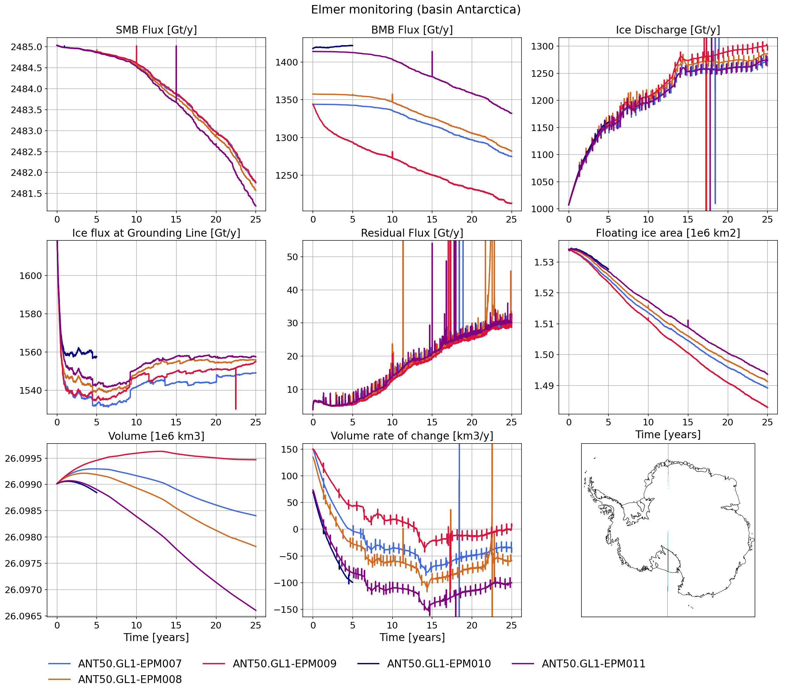

# Monitoring

## Requierements

To run this monitoring tools you need:
- python with the following modules

```
name: elmer
channels:
  - defaults
dependencies:
  - python=3.7
  - cartopy
  - pyproj
  - netcdf4
  - numpy
  - xarray
  - matplotlib
``` 

## Instalation

- Step 0: Create your conda environement : `conda env create -f elmer.yml`
- Step 1: load conda environement : `conda activate elmer`
- Step 2: add your simulation name and plot design in *style_elmer.db*
- Step 3: run valelmer.py (see usage for details)

## Usage

```
python valelmer.py

usage: valelmer.py [-h] -runid runid list [runid list ...]
                   [-basin basin number] [-dir directory of input file]
                   [-o figure_name] [-noshow]
```

***Exemple:***
```
python valelmer.py -runid ANT50.GL1-EPM007 ANT50.GL1-EPM008 ANT50.GL1-EPM009 ANT50.GL1-EPM010 ANT50.GL1-EPM011 -basin 00 -dir /scratch/cnt0021/egi6035/pmathiot/ELMER/ANT50.GL1/ -o test_00.png
```


## Tuning
- If your basin file is different, you need to update the *basin_elmer.yml* file
- If your the variable name/units/... is different to the one I used, you need to update the python script
- If you do not use the Elmer config manager, you need to update the data path in the python script
